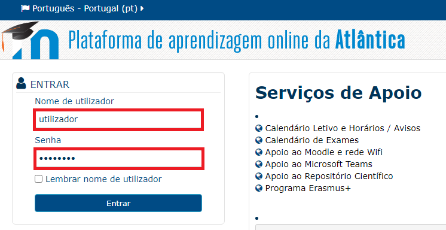
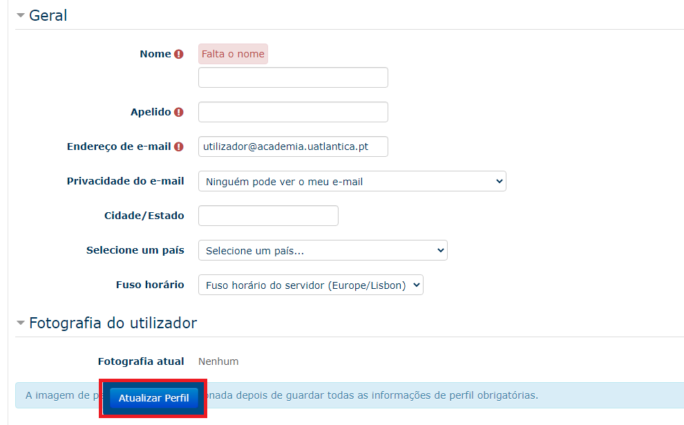

####################
Conta do Utilizador
####################

.. note::
	Esta documentação aplica-se para **ambas** as plataformas Moodle (**Atlântica e ESSATLA**)
	
******************
Acesso
******************
Para aceder ao Moodle abra um navegador de internet e digite o endereço, de acordo com a escola a que pertence:

* Moodle da Atlântica: https://moodle.uatlantica.pt/
* Moodle da ESSATLA: https://moodle.essatla.pt/

Em alternativa pode aceder à página "Campus Virtual" no site principal, e selecionar a opção "E-Learning":

* Campus Virtual Atlântica: https://www.uatlantica.pt/index.php/campus-virtual/
* Campus Virtual ESSATLA: https://www.essatla.pt/index.php/campus-virtual/
	
******************
Login
******************
Insira as credenciais de acesso fornecidas pela Secretaria *(Recebida após a matrícula)* / Centro de Informática *(Ao pedir um reset à password)*.

.. warning::
	Em caso de erro no acesso, contacte o Centro de Informática através do *email* suporte@uatlantica.pt

Após o primeiro login, serão pedidas algumas informações obrigatórias. Pode também adicionar uma fotografia de perfil.

Preencher os campos necessários e para efetuar as alterações carregar no botão "Atualizar Perfil".

.. note::
	No endereço de email recomenda-se utilizar o email de aluno **utilizador@academia.uatlantica.pt**, ou o email de docente **utilizador@uatlantica.pt**

Também após o primeiro acesso, deve concordar com as nossas Políticas de Cookies e fornecer o consentimento da política.

Após seguir estes passos a conta está pronta a ser utilizada. Pode também alterar o perfil e a password para uma mais remembrável.

******************
Editar Perfil
******************
Info...

******************
Alterar Password
******************
Info...