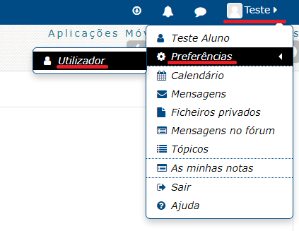
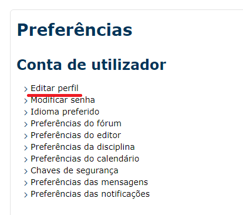
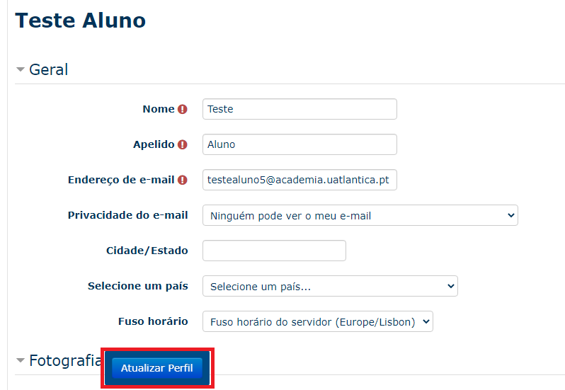
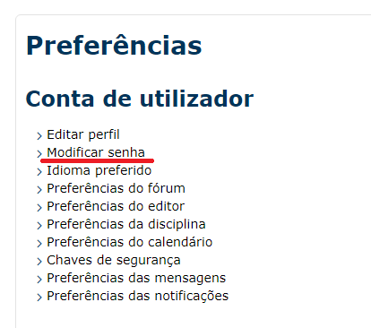
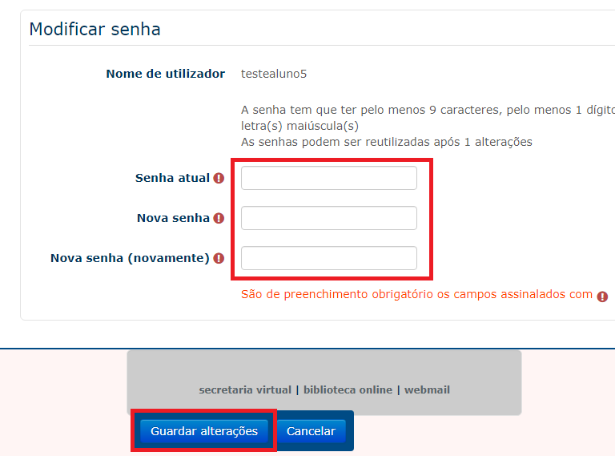
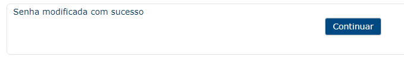
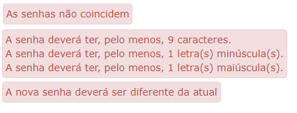

####################
Conta do Utilizador
####################

.. note::
	Esta documentação aplica-se para **ambas** as plataformas Moodle (**Atlântica e ESSATLA**)
	
******************
Acesso
******************
Para aceder ao Moodle abra um navegador de internet e digite o endereço, de acordo com a escola a que pertence:

* Moodle da Atlântica: https://moodle.uatlantica.pt/
* Moodle da ESSATLA: https://moodle.essatla.pt/

Em alternativa pode aceder à página "Campus Virtual" no site principal, e selecionar a opção "E-Learning":

* Campus Virtual Atlântica: https://www.uatlantica.pt/index.php/campus-virtual/
* Campus Virtual ESSATLA: https://www.essatla.pt/index.php/campus-virtual/
	
******************
Login
******************
Insira as credenciais de acesso fornecidas pela Secretaria *(Recebida após a matrícula)* / Centro de Informática *(Ao pedir um reset à password)*.

.. warning::
	Em caso de erro no acesso, contacte o Centro de Informática através do *email* suporte@uatlantica.pt

.. image:: login_1.png
	:align: center

Após o primeiro login, serão pedidas algumas informações obrigatórias. Pode também adicionar uma fotografia de perfil.

Preencher os campos necessários e para efetuar as alterações carregar no botão "Atualizar Perfil".

.. note::
	No endereço de email recomenda-se utilizar o email de aluno **utilizador@academia.uatlantica.pt**, ou o email de docente **utilizador@uatlantica.pt**

.. image:: login_2.png
	:align: center

Também após o primeiro acesso, deve concordar com as nossas Políticas de Cookies e fornecer o consentimento da política.

Após seguir estes passos a conta está pronta a ser utilizada. Pode também alterar o perfil e a password para uma mais memorável.

******************
Editar Perfil
******************
No Moodle pode alterar algumas configurações de utilizador como o nome, email de notificações e definições de privacidade.

Para aceder deve selecionar o nome de utilizador (no canto superior direito na página) e de seguida "Preferências" > "Utilizador".

	
Na nova página que abre encontra várias definições que pode alterar. Para editar as informações de perfil, selecionar a primeira opção "Editar perfil".

	
Após realizar as alterações desejadas, selecionar a opção "Atualizar Perfil".

******************
Alterar Password
******************
Por vezes precisamos de alterar a password, seja porque está prestes a expirar (**expira a cada 6 meses**) ou porque queremos escolher para uma que nós conhecemos.

.. warning::
	Não recomendamos a utilização de passwords que utilizam noutros serviços. Por favor escolher uma password diferente, ou manter a fornecida pelos serviços.

Para alterar a password, seguir o primeiro passo para aceder às opções de perfil ("Preferências" > "Utilizador"), e desta vez selecionar a opção "Modificar senha".

	
Preencher com a senha atual e com a "Nova senha" duas vezes.

.. note::
	Ter atenção que a password deve conter **no mínimo 9 caracteres**, entre eles pelo menos **1 dígito**, pelo menos **1 letra minúscula** e pelo menos **1 letra maiúscula**.
	

	
Apos concluido selecionar a opção "Guardar opções".

Caso a password seja alterada com sucesso, será apresentada a seguinte mensagem:

Caso contrário aparece um dos seguintes erros, em baixo do campo em questão:

.. note::
	Ao alterar a password no Moodle, esta também será alterada para o **E-mail Institucional** e **Acesso Wi-Fi**. E **não será alterada a password da Secretaria Virtual**.