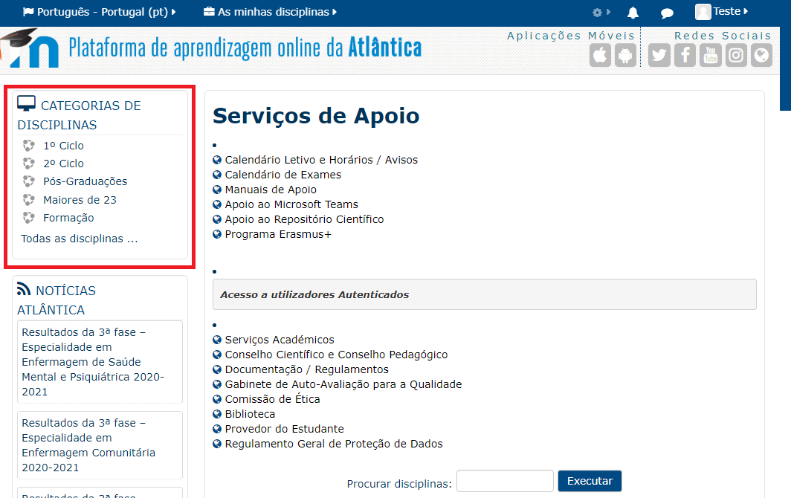
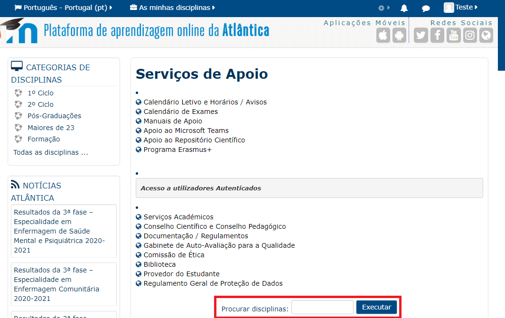
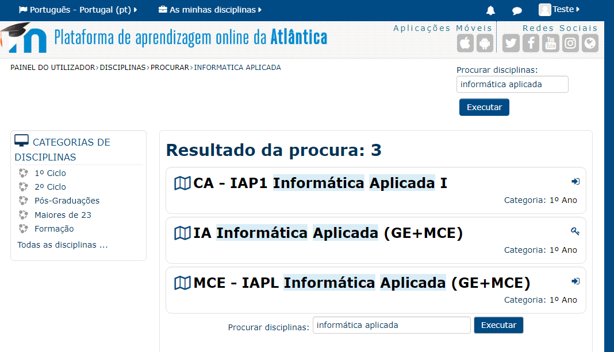
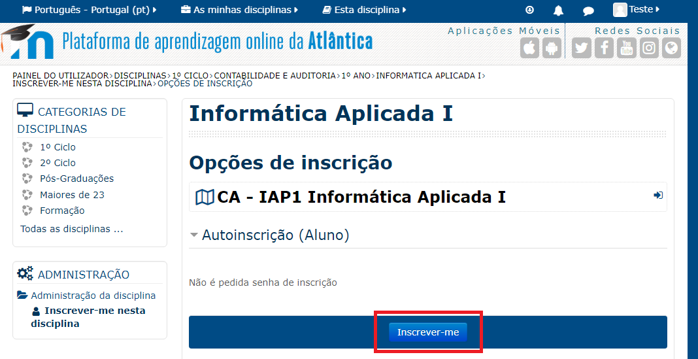
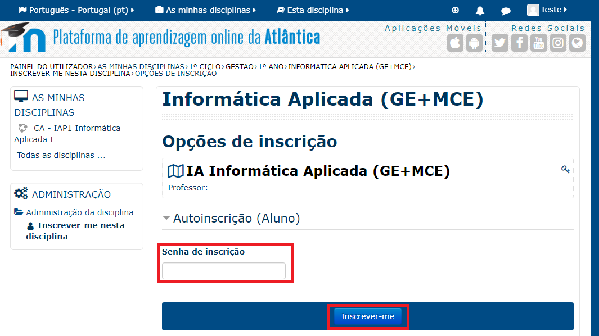
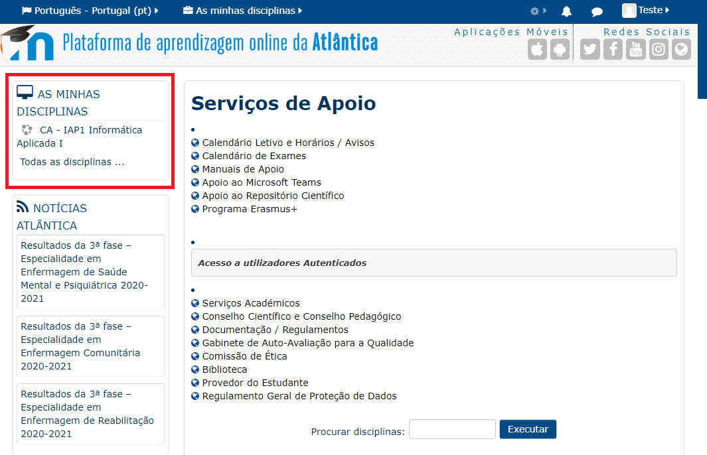
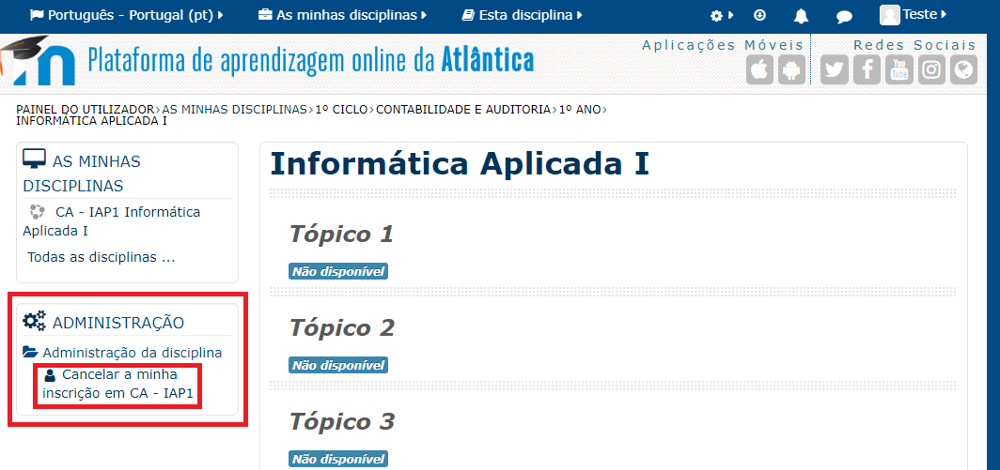
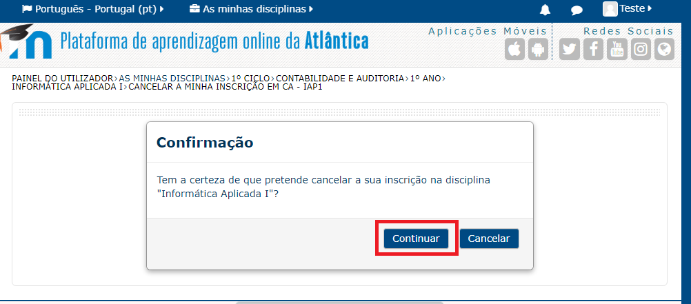

#######################
Utilização para Alunos
#######################

.. note::
	Esta documentação aplica-se para ambas as plataformas Moodle (Atlântica e ESSATLA)

*************************
Inscrição em disciplinas
*************************
Após efetuado o login, deve-se inscrever nas disciplinas em que vai participar.

Existem duas opções para procurar disciplinas. Uma das opções é selecionar a disciplina através das "Categorias de Disciplinas".

Através deste menu (localizado na lateral esquerda da página, imagem em baixo), deve selecionar o seu ciclo de estudos, de seguida o curso, e finalmente o ano. Após selecionar o ano aparecem as disciplinas disponíveis para o curso.

	
A outra opção é utilizar a caixa de pesquisa "Procurar disciplinas que se localiza na página inicial.

Ao pesquisar, selecionar a que se pretende inscrever.

Para efetuar a inscrição, selecionar a opção "Inscrever-me".

.. note::
	Poderá ser solicitada uma chave de inscrição que o professor da disciplina irá disponibilizar. **Caso não tenha a password deve entrar em contacto primeiro com o professor, antes de recorrer ao Suporte Informático**.

Caso seja pedido uma senha de inscrição, inserir a senha que o professor forneceu, e selecionar "Inscrever-me".

Após seguir estes passos, encontra-se inscrito na disciplina e com acesso aos conteúdos disponibilizados pelo professor.

**********************
Acesso às disciplinas
**********************
Para acesso às disciplinas que se inscreveu, pode encontrá-las de forma rápida através do menu "As Minhas Disciplinas", localizado no lado esquerdo da página.

*********************************
Remover inscrição de disciplinas
*********************************

.. warning::
	Caso tenha trabalhos ou até testes na disciplina cuja avaliação ainda não tenha sido inserida na Secretaria Virtual, não cancele a inscrição no Moodle. Verifique primeiro se a disciplina já está 100% concluída, pois os resultados dados no Moodle podem ser perdidos quando cancelar a inscrição.

Caso já não necessite de ter acesso a uma disciplina, pode sempre cancelar a inscrição através da página da mesma.

Para isso, deve aceder à disciplina, e no menu à esquerda "Administração", encontrará a opção "Cancelar a minha inscrição em ...".

Para confirmar, selecionar "Continuar".

